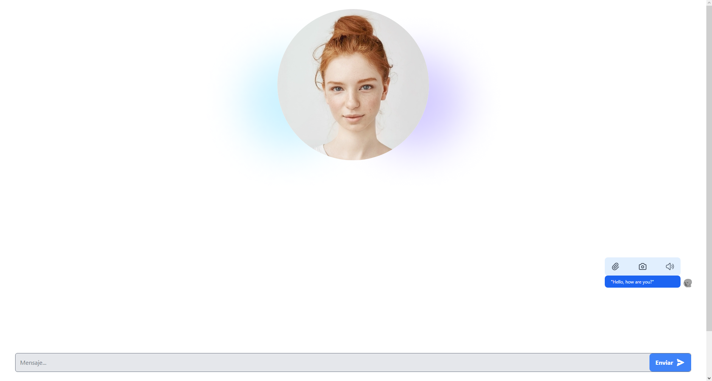

# ChatBot
#Descripción
Este proyecto es un chatbot que utiliza la API de chat GPT para responder preguntas. El usuario puede ingresar sus preguntas en una caja de texto y enviarlas haciendo clic en un botón. Cuando se envía una pregunta, se genera un elemento que muestra el mensaje del chatbot. Este elemento tiene tres botones en la parte superior: el primero permite copiar el contenido del mensaje al portapapeles, el segundo toma una captura del mensaje y lo muestra en la parte inferior de la página, y el tercer botón hace que el texto del mensaje sea leído en voz alta.

#Instalación
Este proyecto está realizado en HTML, Tailwind CSS y JavaScript. Para ejecutarlo, simplemente abre el archivo index.html en tu navegador.

#Uso
Para usar el chatbot, sigue estos pasos:

Abre el archivo index.html en tu navegador.
Ingresa tu pregunta en la caja de texto.
Haz clic en el botón “Enviar” para enviar tu pregunta.
Espera a que el chatbot genere una respuesta y la muestre en la pantalla.
Si quieres copiar el contenido del mensaje al portapapeles, haz clic en el primer botón en la parte superior del elemento del mensaje.
Si quieres tomar una captura del mensaje y mostrarla en la parte inferior de la página, haz clic en el segundo botón en la parte superior del elemento del mensaje.
Si quieres que el texto del mensaje sea leído en voz alta, haz clic en el tercer botón en la parte superior del elemento del mensaje.

